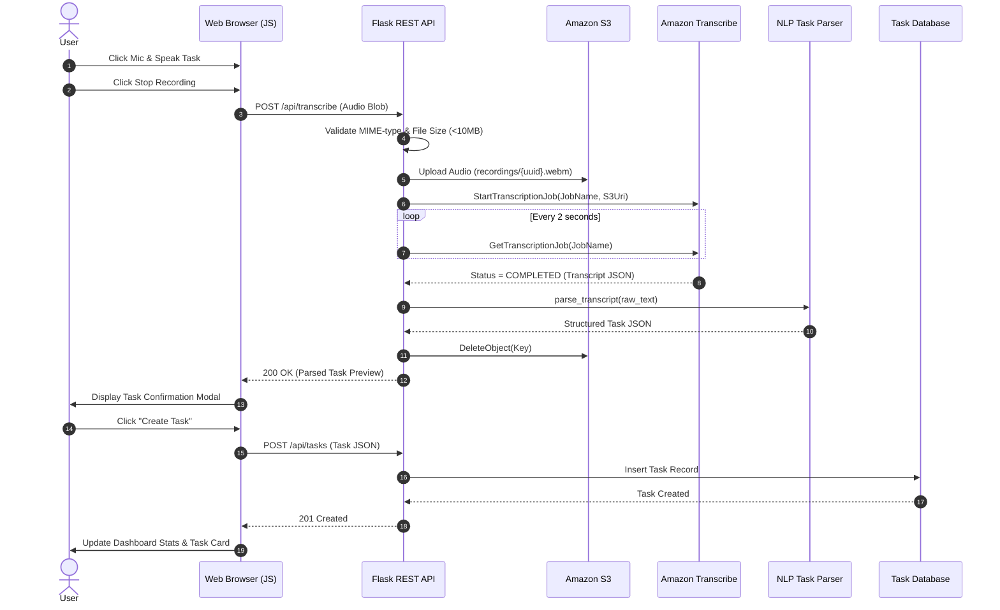
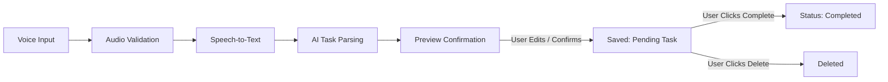

# System Architecture & Design
## AI Voice-to-Text Task Manager using AWS

---

## 1. Architectural Principles

- **Strict Frontend/Backend Separation**: Zero cloud credentials, secret keys, or AWS SDK calls exist in frontend JavaScript code.
- **RESTful API Interface**: Standard JSON over HTTP endpoints for all communication between browser and server.
- **Cloud-Native Native AWS Services**: Amazon S3 for binary object storage, Amazon Transcribe for speech-to-text, and Amazon EC2 for application server hosting.
- **Resilient Fallback Mode**: Graceful local fallback for development environments without live AWS keys.

---

## 2. Mermaid Diagrams

### A. System Architecture Diagram

```mermaid
flowchart TD
    subgraph Client ["Frontend Client (Browser)"]
        UI["Dashboard UI (HTML5/CSS3)"]
        REC["MediaRecorder API"]
    end

    subgraph Server ["Flask Backend (Python / EC2)"]
        API["Flask REST API"]
        VAL["Audio & Input Validator"]
        PARSER["NLP Task Parser"]
        DB_SVC["Task Service"]
    end

    subgraph AWS ["AWS Cloud Infrastructure"]
        S3["Amazon S3 Bucket"]
        TRANS["Amazon Transcribe"]
        DDB["Amazon DynamoDB / SQLite"]
    end

    UI -->|1. Record Voice| REC
    REC -->|2. POST /api/transcribe| API
    API -->|3. Validate Format/Size| VAL
    VAL -->|4. Temporary Upload| S3
    API -->|5. Trigger ASR Job| TRANS
    S3 -->|6. Audio Stream| TRANS
    TRANS -->|7. Transcript Text| API
    API -->|8. Natural Language Parsing| PARSER
    PARSER -->|9. Draft Task Schema| UI
    UI -->|10. User Confirm (POST /api/tasks)| API
    API -->|11. Persist Data| DB_SVC
    DB_SVC -->|12. Save Record| DDB
    API -->|13. Delete Temp Object| S3
```

### B. Voice-to-Task Pipeline Sequence Diagram



### C. Task Lifecycle Flowchart


